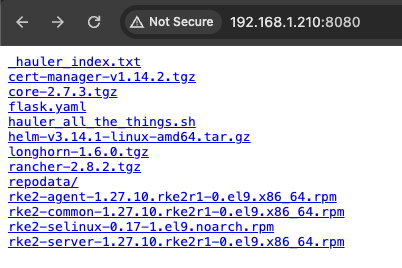

# Use Hauler to Air Gap the Rancher Stack


**DISCLAIMER - THIS IS NOT MEANT FOR PRODUCTION! - Open a github issue first! - DISCLAIMER**
---

This guide is very similar to [Simple RKE2, Neuvector, Longhorn, and Rancher Install ](https://github.com/clemenko/rke_install_blog), except in one major way. This guide will provide a strategy for air gapping all the bits needed for RKE2, Longhorn and Rancher. This is just one opinion. We are starting from the idea that there is no container infrastructure available.

Throughout my career there has always been a disconnect between the documentation and the practical implementation. The Kubernetes (k8s) ecosystem is no stranger to this problem. This guide is a simple approach to installing Kubernetes and some REALLY useful tools. We will walk through installing all the following.

- [Hauler](https://rancherfederal.github.io/hauler-docs/) - Airgap Swiss Army Knife
- [RKE2](https://docs.rke2.io) - Security focused Kubernetes
- [Rancher](https://www.suse.com/products/suse-rancher/) - Multi-Cluster Kubernetes Management
- [Longhorn](https://longhorn.io) - Unified storage layer
- [Neuvector](https://neuvector.com/) - Kubernetes Security Platform

We will need a few tools for this guide. Hopefully everything at handled by my [hauler_all_the_things.sh](https://github.com/clemenko/rke_airgap_install/blob/main/hauler_all_the_things.sh) script. For this guide all the commands will be in the script.

For those that like videos, https://youtu.be/Wu6oWNZmVK4.

---

> **Table of Contents**:
>
> * [Whoami](#whoami)
> * [Goal](#goal)
> * [Prerequisites](#prerequisites)
> * [Build](#Build)
> * [Deploy Control Plane](#deploy-control-plane)
> * [Deploy Workers](#deploy-workers)
> * [Rancher](#Rancher)
> * [Longhorn](#Longhorn)
> * [Neuvector](#Neuvector)
> * [Validate Images](#validate-images)
> * [Conclusion](#conclusion)

---

## Whoami

Just a geek - Andy Clemenko - @clemenko - clemenko@gmail.com

## Goal

To simplify the steps it takes to airgap AND deploy rke2, Rancher, Longhorn, and NeuVector.

## Prerequisites

The prerequisites are fairly simple. We need 4 [Rocky](https://rockylinux.org/) Linux servers. Centos or Rhel work just as well. Start with 4 core, 8Gb Ram, and 80Gb hard drive. All the servers will need access to a yum repo server. One of the servers will need access to the internet. The other three should be on the other side of the airgap. The servers can be bare metal or your favorite vm of choice. The three, or more, air gapped servers should not have firewalls in between each other. We will need an `ssh` client to connect to the servers. DNS is a great to have but not necessary. Everything will run as `root`.


## Build

Here is the cool part of this upgrade. [Hauler](https://rancherfederal.github.io/hauler-docs/) allows the collection, moving, and serving of files across the airgap. [Hauler](https://rancherfederal.github.io/hauler-docs/) dramatically improves the process. Simply get the script from [github](https://github.com/clemenko/rke_airgap_install/blob/main/hauler_all_the_things.sh). We will run it on the "Build Server" that has access to the internet.

```bash
# make the directory
mkdir /opt/hauler

# change dir
cd /opt/hauler

# get script
curl -#OL https://raw.githubusercontent.com/clemenko/rke_airgap_install/main/hauler_all_the_things.sh 

# make it executable
chmod 755 hauler_all_the_things.sh

# run the build process
./hauler_all_the_things.sh build
```
 
The [build function](https://github.com/clemenko/rke_airgap_install/blob/main/hauler_all_the_things.sh#L42) will collect all the charts, images, and files needed. And then package it all up.  
Here is an example output:

```text
[root@internet hauler]# ./hauler_all_the_things.sh build
[info] checking for hauler / ztsd / jq / helm
  - installed  ok 

[info] creating hauler manifest
  - created airgap_hauler.yaml ok 

[info] - hauler store sync
  - synced ok 

[info] - hauler store save
  - saved ok 

[info] - compressing all the things
  - created /opt/hauler_airgap_02_20_24.zst  ok 

---------------------------------------------------------------------------
    move file to other network...
    then uncompress with : 
      yum install -y zstd
      mkdir /opt/hauler
      tar -I zstd -vxf hauler_airgap_02_20_24.zst -C /opt/hauler
---------------------------------------------------------------------------
```

## Move the tar

Move `/opt/hauler_airgap_%DATE%.zst` across the air gap. The file is currently 7.4G. We are looking at ways to make it smaller.

## Deploy Control Plane

One of the great features of [Hauler](https://rancherfederal.github.io/hauler-docs/)  is that it can serve a registry server on port `5000` AND a file server on port `8080`. This will give us the opportunity to stream line the deployment process air gapped. 

Let's start with copying the zst to the first node, let's call it `airgap1`. The control [control function](https://github.com/clemenko/rke_airgap_install/blob/main/hauler_all_the_things.sh#L301) will deploy hauler to serve a registry and fileserver. Then install rke2 from RPMs.

Please install zstd before trying to uncompress the zst.

```bash
# install zst
yum install -y zstd

#m make dir
mkdir /opt/hauler

# untar to the /opt/hauler dir
tar -I zstd -vxf hauler_airgap_02_20_24.zst -C /opt/hauler
```

Once uncompressed we are ready install the control node with:

```bash
# get in the right dir
cd /opt/hauler

# install hauler and the rke2 for the control plane node
./hauler_all_the_things.sh control
```

Example output:

```bash
[root@air1 hauler]# ./hauler_all_the_things.sh control
[info] setting up hauler
2:20PM INF loading content from [/opt/hauler/haul.tar.zst] to [store]
Created symlink /etc/systemd/system/multi-user.target.wants/hauler@registry.service → /etc/systemd/system/hauler@.service.
 - registry started ok 

Created symlink /etc/systemd/system/multi-user.target.wants/hauler@fileserver.service → /etc/systemd/system/hauler@.service.
 - fileserver started ok 

[info] updating kernel settings
[info] installing base packages
[info] installing rke2
[info] cluster active
[info] installing helm
------------------------------------------------------------------------------------
  Run:  'source ~/.bashrc' 
  Run on the worker nodes
  - ' curl -sfL http://192.168.1.210:8080/./hauler_all_the_things.sh | bash -s -- worker 192.168.1.210 '
------------------------------------------------------------------------------------
```

Fantastic, let's check that everything is working.

```bash
# source the bashrc
source ~/.bashrc
```

```bash
# check for the two hauler serve ports 8080 and 5000
ss -tln | grep "8080\|5000"
```

```bash
# check that pods are coming up
kubectl get pod -A
```

One last thing to check is the web interface for the fileserver.  
Navigate to the IP of the first node on port `8080`.



One "nice to have" is the file named `_hauler_index.txt`. This is the entire listing of what was moved. This is a good way to double check if anything is missing.

If everything looks good then we can proceed to the work nodes.

## Deploy Workers

Thanks to Hauler we have a simple method for `curl | bash` the script to the nodes. Feel free to check out the [worker function](https://github.com/clemenko/rke_airgap_install/blob/main/hauler_all_the_things.sh#L374).  
From the `./hauler_all_the_things.sh control` we were given the command to run on the workers. Note the IP address will be different.

```bash
curl -sfL http://192.168.1.210:8080/./hauler_all_the_things.sh | bash -s -- worker 192.168.1.210 
```

Here is a sample output:

```text
[root@air2 ~]# curl -sfL http://192.168.1.210:8080/./hauler_all_the_things.sh | bash -s -- worker 192.168.1.210 
- deploy worker
[info] updating kernel settings
[info] installing base packages
[info] worker node running
```

We can validate the node(s) are connect by going to the control plane node and running `kubectl get node`.

```bash
[root@air ~]# kubectl get node
NAME   STATUS   ROLES                       AGE   VERSION
air1    Ready    control-plane,etcd,master   54m   v1.27.10+rke2r1
air2    Ready    <none>                      17s   v1.27.10+rke2r1
air3    Ready    <none>                      17s   v1.27.10+rke2r1
```

Huzzah! We can now focus on deploying the application Longhorn, Rancher, And NeuVector.

## Rancher

Thanks again to hauler for support OCI helm charts. Meaning we do not need to "download" anything to the control plane node. Feel free to check out the [Rancher function](https://github.com/clemenko/rke_airgap_install/blob/main/hauler_all_the_things.sh#L427).  The command is fairly simple. By default the URL for Rancher is `rancher.awesome.sauce`. To change the domain. Edit the script on [line 13](https://github.com/clemenko/rke_airgap_install/blob/main/hauler_all_the_things.sh#L13) and change the `DOMAIN` there.

```bash
# deploy rancher
./hauler_all_the_things.sh rancher
```

Example output:

```text
[root@air1 hauler]# ./hauler_all_the_things.sh rancher
[info] deploying cert-manager
Release "cert-manager" does not exist. Installing it now.
Pulled: 192.168.1.210:5000/hauler/cert-manager:v1.14.2
Digest: sha256:dc037fbd36fac13ece364bdaebf44c46b722adb110ceff53f7572c2d7b8adc37
NAME: cert-manager
LAST DEPLOYED: Tue Feb 20 14:29:18 2024
NAMESPACE: cert-manager
STATUS: deployed
REVISION: 1
TEST SUITE: None
NOTES:
cert-manager v1.14.2 has been deployed successfully!

In order to begin issuing certificates, you will need to set up a ClusterIssuer
or Issuer resource (for example, by creating a 'letsencrypt-staging' issuer).

More information on the different types of issuers and how to configure them
can be found in our documentation:

https://cert-manager.io/docs/configuration/

For information on how to configure cert-manager to automatically provision
Certificates for Ingress resources, take a look at the `ingress-shim`
documentation:

https://cert-manager.io/docs/usage/ingress/
[info] deploying rancher
Release "rancher" does not exist. Installing it now.
Pulled: 192.168.1.210:5000/hauler/rancher:2.8.2
Digest: sha256:27e742f51e66e32512509a95523bc9a531ec63f723c730b47685e7678cbc30d3
NAME: rancher
LAST DEPLOYED: Tue Feb 20 14:29:33 2024
NAMESPACE: cattle-system
STATUS: deployed
REVISION: 1
TEST SUITE: None
NOTES:
Rancher Server has been installed.

NOTE: Rancher may take several minutes to fully initialize. Please standby while Certificates are being issued, Containers are started and the Ingress rule comes up.

Check out our docs at https://rancher.com/docs/

If you provided your own bootstrap password during installation, browse to https://rancher.awesome.sauce to get started.

If this is the first time you installed Rancher, get started by running this command and clicking the URL it generates:

echo https://rancher.awesome.sauce/dashboard/?setup=$(kubectl get secret --namespace cattle-system bootstrap-secret -o go-template='{{.data.bootstrapPassword|base64decode}}')

To get just the bootstrap password on its own, run:

kubectl get secret --namespace cattle-system bootstrap-secret -o go-template='{{.data.bootstrapPassword|base64decode}}{{ "\n" }}'

Happy Containering!
   - bootstrap password = "bootStrapAllTheThings" 
```

Once deployed you can log into you URL with `https` and start the bootstrapping process. The initial bootstrap password is `bootStrapAllTheThings`.

We can check to see if everything is coming up with:

```bash
# check the pods
kubectl get pod -n cattle-system
```

If everything looks good move on to the next application.

## Longhorn

NeuVector is the same as the others.  
Feel free to check out the [Longhorn function](https://github.com/clemenko/rke_airgap_install/blob/main/hauler_all_the_things.sh#L413). By default the URL for Longhorn is `longhorn.awesome.sauce`. To change the domain. Edit the script on [line 13](https://github.com/clemenko/rke_airgap_install/blob/main/hauler_all_the_things.sh#L13) and change the `DOMAIN` there.

```bash
# deploy longhorn
./hauler_all_the_things.sh longhorn
```

Example output:

```text
[root@air1 hauler]# ./hauler_all_the_things.sh longhorn
[info] deploying longhorn
Release "longhorn" does not exist. Installing it now.
Pulled: 192.168.1.210:5000/hauler/longhorn:1.6.0
Digest: sha256:318fe85c5a5d4e4b52b1d4451e313c4239c876af2a3f564474d05cb29ac690e3
NAME: longhorn
LAST DEPLOYED: Tue Feb 20 14:27:28 2024
NAMESPACE: longhorn-system
STATUS: deployed
REVISION: 1
TEST SUITE: None
NOTES:
Longhorn is now installed on the cluster!

Please wait a few minutes for other Longhorn components such as CSI deployments, Engine Images, and Instance Managers to be initialized.

Visit our documentation at https://longhorn.io/docs/
```

We can check to see if everything is coming up with:

```bash
# check the pods
kubectl get pod -n longhorn-system
```

If everything looks good move on to the next application.

## Neuvector

NeuVector is the same as the others.  
Feel free to check out the [NeuVector function](https://github.com/clemenko/rke_airgap_install/blob/main/hauler_all_the_things.sh#L420). By default the URL for NeuVector is `neuvector.awesome.sauce`. To change the domain. Edit the script on [line 13](https://github.com/clemenko/rke_airgap_install/blob/main/hauler_all_the_things.sh#L13) and change the `DOMAIN` there.

```bash
# deploy neuvector
./hauler_all_the_things.sh neuvector
```

We can check to see if everything is coming up with:

```bash
# check the pods
kubectl get pod -n neuvector
```

Example output:

```text
[root@air hauler]# ./hauler_all_the_things.sh neuvector
[info] deploying neuvector
Release "neuvector" does not exist. Installing it now.
Pulled: 192.168.1.210:5000/hauler/core:2.7.3
Digest: sha256:0c8526de3450c418acd4e3e533115ee5a8b3c9f3a9551939fd7223c1d21811ad
NAME: neuvector
LAST DEPLOYED: Tue Feb 20 15:42:57 2024
NAMESPACE: neuvector
STATUS: deployed
REVISION: 1
TEST SUITE: None
NOTES:
From outside the cluster, the NeuVector URL is:
http://neuvector.awesome.sauce
```

## Bonus - Flask Application

This is a simple 3 tier web app. Feel free to check out the [flask function](https://github.com/clemenko/rke_airgap_install/blob/main/hauler_all_the_things.sh#L406). This is going to `curl` the fileserver, change a few variables, and the `kubectl apply`. To change the domain. Edit the script on [line 13](https://github.com/clemenko/rke_airgap_install/blob/main/hauler_all_the_things.sh#L13) and change the `DOMAIN` there.

```bash
# deploy flask
./hauler_all_the_things.sh flask
```

The flask app deploys to `flask.awesome.sauce` if you are curious.

## Validate Images

As a nice to have here is a command to validate the images are loaded from the local registry. Note that some of the images are pre-loaded and will look like they were loaded from the internet.

```bash
kubectl get pods -A -o jsonpath="{.items[*].spec.containers[*].image}" | tr -s '[[:space:]]' '\n' |sort | uniq -c
```

## Conclusion

**DISCLAIMER - THIS IS NOT MEANT FOR PRODUCTION! - Open a github issue first! - DISCLAIMER**
---

Thanks to Hauler, we have a great foundation for installing RKE2, Neuvector, Longhorn, and Rancher air gapped. Keep in mind that this script is inteded for Proofs of Concepts and testing!. Please reach out to have a deeper conversation about what a PRODUCTION system looks like in your environment.

Oh and subscribe!


