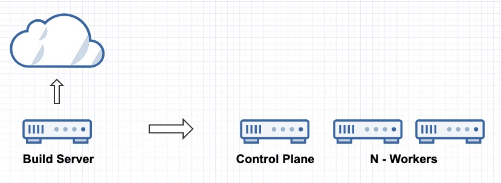

# How to Air Gap RKE2, Neuvector, Longhorn, and Rancher


This guide is very similar to [Simple RKE2, Neuvector, Longhorn, and Rancher Install ](https://github.com/clemenko/rke_install_blog), except in one major way. This guide will provide a strategy for air gapping all the bits needed for RKE2, Longhorn and Rancher. This is just one opinion. We are starting from the idea that there is no container infrastructure available.

Throughout my career there has always been a disconnect between the documentation and the practical implementation. The Kubernetes (k8s) ecosystem is no stranger to this problem. This guide is a simple approach to installing Kubernetes and some REALLY useful tools. We will walk through installing all the following.

- [RKE2](https://docs.rke2.io) - Security focused Kubernetes
- [Rancher](https://www.suse.com/products/suse-rancher/) - Multi-Cluster Kubernetes Management
- [Longhorn](https://longhorn.io) - Unified storage layer
- [Neuvector](https://neuvector.com/) - Kubernetes Security Platform

We will need a few tools for this guide. Hopefully everything at handled by my [air_gap_all_the_things.sh](https://github.com/clemenko/rke_airgap_install/blob/main/air_gap_all_the_things.sh) script. For this guide all the commands will be in the script.

---

> **Table of Contents**:
>
> * [Whoami](#whoami)
> * [Prerequisites](#prerequisites)
> * [Build](#Build)
> * [Deploy Control Plane](#Deploy_Control_Plane)
> * [Deploy Workers](#Deploy_Workers)
> * [Rancher](#Rancher)
> * [Longhorn](#Longhorn)
> * [Neuvector](#Neuvector)
> * [tl:dr](#tldr)
> * [Validate Images](#Validate_Images)
> * [Dockerfile](#Dockerfile)
> * [Conclusion](#conclusion)

---

## Whoami

Just a geek - Andy Clemenko - @clemenko - andy.clemenko@rancherfederal.com

## Prerequisites

The prerequisites are fairly simple. We need 4 Rocky Linux servers. Centos or Rhel work just as well. Start with 4 core, 8Gb Ram, and 80Gb hard drive. All the servers will need access to a yum repo server. One of the servers will need access to the internet. The other three should be on the other side of the airgap. The servers can be bare metal or your favorite vm of choice. For the video I am going to use [Harvester](https://www.rancher.com/products/harvester) running on a 1u server. We will need an `ssh` client to connect to the servers. DNS is a great to have but not necessary.



Before you build take a look at all the files in the repo at [https://github.com/clemenko/rke_airgap_install](https://github.com/clemenko/rke_airgap_install)

## Build

Because we are moving bits across an air gap we need a server with access to the internet. Let's ssh into the build server to start the download/build process. There are a few tools we will need like [Skopeo](https://github.com/containers/skopeo) and [Helm](https://helm.sh/). We will walk through getting everything needed. We will need root for all three servers. The following instructions are going to be high level. The script [air_gap_all_the_things.sh](https://github.com/clemenko/rke_airgap_install/blob/main/air_gap_all_the_things.sh) will take care of almost everything.

All the steps below are covered in geeky detail in the scripts [build function](https://github.com/clemenko/rke_airgap_install/blob/main/air_gap_all_the_things.sh#L23).

- Set Versions
- Install skopeo and zstd
- Mkdir `/opt/rancher`
- Download RKE2 files
- Get Helm
- Add Helm Repos
- Pull Helm Charts
- Pull Image Lists
- Clean Rancher Image List - Remove older versions
- Skopeo `copy` All Images, Including Registry
- Compress

There are quite a few steps in building the Tar.

## Move the tar

At the time of writing this guide the compressed zst is 5.3G. Looks like there are some images that can be removed from the ZST. Your mileage may vary.

## Deploy Control Plane

At a high level we are going to install RKE2 on the first air gapped node. Let's start with copying the zst to the first node, let's call it `airgap1`. There are some needed packages on all three nodes. This packages as well as come kernel tuning can be found in the [air_gap_all_the_things.sh](https://github.com/clemenko/rke_airgap_install/blob/main/air_gap_all_the_things.sh#L132) script. We will need to apply the same to all the nodes.

### Uncompress

Move the `rke2_rancher_longhorn.zst` to `/opt/`. From there we can uncompress it.

```bash
  yum install -y zstd
  mkdir /opt/rancher
  tar -I zstd -vxf rke2_rancher_longhorn.zst -C /opt/rancher
```

We should now see all the files in the `/opt/rancher` directory.

```bash
[root@airgap1 opt]# ls -asl rancher/
total 24
 0 drwxr-xr-x. 5 root root    84 Nov 30 15:45 .
 0 drwxr-xr-x. 3 root root    54 Nov 30 15:50 ..
20 -rwxr-xr-x. 1 root root 18634 Nov 30 15:28 air_gap_all_the_things.sh
 0 drwxr-xr-x. 3 root root   143 Nov 30 15:45 helm
 0 drwxr-xr-x. 7 root root    78 Nov 30 15:45 images
 4 drwxr-xr-x. 2 root root  4096 Nov 30 15:45 rke2_1.24.8
```

Fantastic, let's build the first control node.

### First Control Plane Node

With everything uncompressed we can now setup the RKE2 on the same, first, node. The high level steps are as follows:

- Add kernel tuning
- Add packages
- Add `etcd` user to the host
- Add RKE2 Configs with the STIG settings
- Add RKE2 Audit Policy
- Add Nginx TLS-Passthrough
- Add Registry Image Locally
- Install & Start RKE2
- Setup Kubectl access
- Setup & Start NFS
- Deploy Registry `localhost:5000`
- Load Images into registry
- Unpack Helm

Of course there is a script [deploy_control function](https://github.com/clemenko/rke_airgap_install/blob/main/air_gap_all_the_things.sh#L195) that gives all the commands.

## Deploy Workers

Now that we have the first node running with RKE2 we can turn our attention to the worker nodes. The design of this guide is to use NFS to server out all the files to the cluster from the first node. This will same a ton of time on copying files around. We will also use the NFS for the registry storage. Here are the high level steps. On each of the worker nodes.

- Add kernel tuning
- Add packages
- Mkdir - `mkdir /opt/rancher`
- Mount First node - `mount $IP:/opt/rancher/`
- Get Join Token from the Control Plane node
- Add RKE2 Configs with the STIG settings
- Add Registry Image Locally
- Install & Start RKE2 as Agent

Rinse and Repeat. The in depth commands can be found in the [deploy worker function](https://github.com/clemenko/rke_airgap_install/blob/main/air_gap_all_the_things.sh#L317).

Now that we have the cluster built we can focus our attention to Rancher and Longhorn.

## Rancher

For Rancher we are going to use the Helm Chart we imported. The good news is that everything we need is already loaded. The first chart we need to deploy is `cert-manager`. Cert Manager is used for creating certificates for Rancher. Please pay attention to all the options for the Helm command. We need to make sure we have the correct image locations and chart locations. Thanks to the NFS mount we are sharing the images to all the nodes. This is not meant for production. But it works well for a development/POC environment.

Note that the `hostname=rancher.awesome.sauce` will need to be changed to reflect your domain/DNS/network.

```bash
helm upgrade -i cert-manager /opt/rancher/helm/cert-manager-v1.10.0.tgz --namespace cert-manager --create-namespace --set installCRDs=true --set image.repository=localhost:5000/cert-manager-controller --set webhook.image.repository=localhost:5000/cert-manager-webhook --set cainjector.image.repository=localhost:5000/cert-manager-cainjector --set startupapicheck.image.repository=localhost:5000/cert-manager-ctl

helm upgrade -i rancher /opt/rancher/helm/rancher-2.7.0.tgz --namespace cattle-system --create-namespace --set bootstrapPassword=bootStrapAllTheThings --set replicas=1 --set auditLog.level=2 --set auditLog.destination=hostPath --set useBundledSystemChart=true --set rancherImage=localhost:5000/rancher/rancher --set systemDefaultRegistry=localhost:5000 --set hostname=rancher.awesome.sauce
```

And not to disappoint there is a function, `rancher`, in the script to help with the deployment. Check out the [tl:dr](#tldr) section. The script will need to be edited.

```bash
./air_gap_all_the_things.sh rancher
```

Once deployed you can log into you URL with `https` and start the bootstrapping process. The initial bootstrap password is `bootStrapAllTheThings`.

## Longhorn

Longhorn is a little more simple than Rancher. It is a single Helm Chart. Once again please change the `export DOMAIN=awesome.sauce`.

```bash
helm upgrade -i longhorn /opt/rancher/helm/longhorn-1.3.2.tgz --namespace longhorn-system --create-namespace --set ingress.enabled=true  --set global.cattle.systemDefaultRegistry=localhost:5000 --set ingress.host=longhorn.awesome.sauce
```

## Neuvector

Along with Longhorn the Neuvector is a simple Helm install. Once again please change the `manager.ingress.host=neuvector.awesome.sauce`.

```bash
helm upgrade -i neuvector /opt/rancher/helm/core-2.5.5.tgz --namespace neuvector --create-namespace  --set imagePullSecrets=regsecret --set k3s.enabled=true --set k3s.runtimePath=/run/k3s/containerd/containerd.sock  --set manager.ingress.enabled=true --set controller.pvc.enabled=true --set controller.pvc.capacity=500Mi --set registry=localhost:5000 --set tag=5.0.5 --set controller.image.repository=neuvector/controller --set enforcer.image.repository=neuvector/enforcer --set manager.image.repository=neuvector/manager --set cve.updater.image.repository=neuvector/updater --set manager.ingress.host=neuvector..awesome.sauce
```

Again the script will simplify things.

## tl:dr

### Get the Script

We are going to use `curl` to get the script from Github. Keep in mind that the script is always being updated. Again this in the first node that has access to the internet.

```bash
mkdir /opt/rancher
cd /opt/rancher
curl -#OL https://raw.githubusercontent.com/clemenko/rke_airgap_install/main/air_gap_all_the_things.sh
chmod 755 air_gap_all_the_things.sh
```

### Check the Versions

Edit `air_gap_all_the_things.sh` and validate the versions are correct.

### Run the Build

Please be patient as it is pulling 15Gb from the interwebs.

```bash
./air_gap_all_the_things.sh build
```

The result will be all the files under `/opt/rancher/` and the tar that needs to be moved `/opt/rke2_rancher_longhorn.zst`.

### Move the Tar

To the first node.

### Deploy Control Plane

```bash
./air_gap_all_the_things.sh control
```

This will setup RKE2, deploy the registry and start NFS.

### Deploy Workers

```bash
./air_gap_all_the_things.sh worker
```

### Update the DOMAIN Variable

```bash
vi ./air_gap_all_the_things.sh
```

### Rancher

```bash
./air_gap_all_the_things.sh rancher
```

### Longhorn

```bash
./air_gap_all_the_things.sh longhorn
```

### Neuvector

```bash
./air_gap_all_the_things.sh neuvector
```

## Validate Images

As a nice to have here is a command to validate the images are loaded from the local registry. Note that some of the images are pre-loaded and will look like they were loaded from the internet.

```bash
kubectl get pods -A -o jsonpath="{.items[*].spec.containers[*].image}" | tr -s '[[:space:]]' '\n' |sort | uniq -c
```

## Dockerfile

Why yes there is a Dockerfile to run the build phase. Take a look at the [Dockerfile](https://github.com/clemenko/rke_airgap_install/blob/main/Dockerfile) in the repo.

## Conclusion

At this point we really good foundation for installing RKE2, Neuvector, Longhorn, and Rancher air gapped. The script is meant to be readable if the process needs to be broken down. Case in point if there a registry available internally then load the images there. The Helm commands will need to be changed to point to that registry.

If there are any issues, please feel free to reach out.


